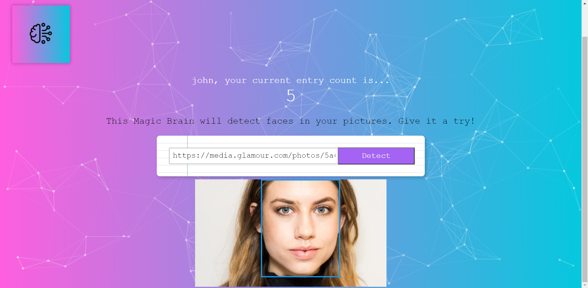

# Face Detection Web Application
This is a front-end side of Face Detection Web Application. The back-end side of this App is [Here](https://github.com/thanathip-sukkulcharoen/Face-Detection-Web-Server)

## Table of Contents
* [Demo](#demo)
* [Features](#features)
* [Prerequisite library](#prerequisite-library)
* [Installation](#installation)
* [Note](#note)
## Demo 
Live demo here --> [Demo](https://smart-brain-thanathip.herokuapp.com/)

If you have **slow experience**, please wait because on the free tier, heroku will take a few seconds to wake up the sleep dyno.
## Features
* Register System
* Sign in & Sign out System
* Face Detection System
## Prerequisite library
* [React](https://reactjs.org/) version 17.0.1
* [Tachyons](https://tachyons.io/) version 4.12.0
* [Clarifai](https://www.clarifai.com/) version 2.9.1

## Installation
Follow the instructions below

## Note 
